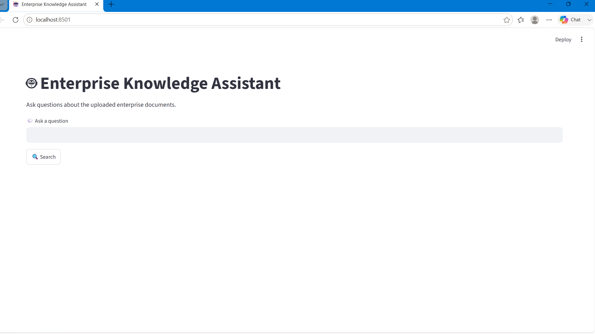
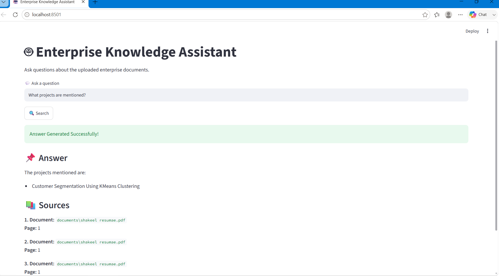

# Enterprise Knowledge Assistant

An AI-powered Enterprise Knowledge Assistant built using Python, Streamlit, LangChain, Google Gemini, FAISS, and HuggingFace Embeddings.

The application allows users to upload enterprise documents (PDFs), automatically create a vector database, and ask natural language questions to retrieve accurate answers from the uploaded documents.


# Project Overview

Enterprise organizations manage thousands of documents including resumes, policies, manuals, reports, contracts, and technical documentation.

Finding the right information manually is time-consuming.

This project solves that problem by using Retrieval Augmented Generation (RAG).

The application:

* Loads enterprise PDF documents
* Splits documents into chunks
* Creates embeddings
* Stores embeddings in a FAISS vector database
* Retrieves the most relevant chunks
* Uses Google Gemini to generate accurate answers


# Features

* Upload multiple PDF documents
* Semantic document search
* AI-powered question answering
* Fast retrieval using FAISS
* Google Gemini integration
* Streamlit web interface
* Source document references
* Environment variable support


# Project Architecture

                 PDF Documents
                       │
                       ▼
             PyPDF Document Loader
                       │
                       ▼
      Recursive Character Text Splitter
                       │
                       ▼
      HuggingFace Embeddings Model
                       │
                       ▼
          FAISS Vector Database
                       │
        User Question via Streamlit
                       │
                       ▼
      Similarity Search from FAISS
                       │
                       ▼
      Relevant Document Chunks
                       │
                       ▼
      Google Gemini 2.5 Flash
                       │
                       ▼
              Final AI Response


# Project Structure

```
chatbot/
│
├── documents/
│     └── shakeel_resume.pdf
│
├── vector_db/
│
├── utils/
│
├── venv/
│
├── app.py
├── ingest.py
├── rag.py
├── requirements.txt
├── .env
└── README.md
```


# Technology Stack

| Technology    | Purpose               |
| ------------- | --------------------- |
| Python        | Backend Development   |
| Streamlit     | Web Interface         |
| LangChain     | RAG Framework         |
| Google Gemini | Large Language Model  |
| HuggingFace   | Text Embeddings       |
| FAISS         | Vector Database       |
| PyPDF         | PDF Loader            |
| dotenv        | Environment Variables |


# ⚙ Installation

## Step 1

Clone the repository

```bash
git clone https://github.com/yourusername/enterprise-knowledge-assistant.git
```


## Step 2

Navigate into the project

```bash
cd enterprise-knowledge-assistant
```


## Step 3

Create Virtual Environment

```bash
python -m venv venv
```


## Step 4

Activate Environment

Windows

```bash
venv\Scripts\activate
```

Mac/Linux

```bash
source venv/bin/activate
```

---

## Step 5

Install Dependencies

```bash
pip install -r requirements.txt
```


#  API Configuration

Create a file named

```
.env
```

Add your Gemini API Key

```
GOOGLE_API_KEY=YOUR_API_KEY
```

You can generate the API key from

https://aistudio.google.com/app/apikey


#  Upload Documents

Place your PDF documents inside

```
documents/
```

Example

```
documents/
    Resume.pdf
    CompanyPolicy.pdf
    EmployeeHandbook.pdf
```


# Create Vector Database

Run

```bash
python ingest.py
```

Output

```
Loading Resume.pdf...

Total Chunks : 18

Vector Database Created Successfully!
```


#  Run Application

```bash
streamlit run app.py
```

Open browser

```
http://localhost:8501
```

#  Example Questions

Ask questions like

```
What experience does Shakeel have?
```

```
Which internships are mentioned?
```

```
What projects are included?
```

```
List technical skills.
```

```
What certifications are available?
```

```
Summarize the resume.
```

```
Which programming languages are known?
```

```
What tools are used?
```


#  Sample Output

Question

```
What projects are mentioned?
```

Answer

```
Customer Segmentation Using K-Means Clustering

Data Visualization Dashboard

Machine Learning Classification Project
```

Sources

```
Resume.pdf

Page 1
```
# RAG Workflow

1. Load PDF Documents
2. Split into smaller chunks
3. Generate embeddings
4. Store vectors in FAISS
5. Receive user query
6. Retrieve relevant chunks
7. Send context to Gemini
8. Generate final answer
9. Display answer with document sources


# Design Decisions

* Used FAISS for efficient similarity search.
* Used HuggingFace embeddings for free and high-quality semantic representations.
* Used Google Gemini 2.5 Flash for fast and accurate responses.
* Used Streamlit for rapid web application development.
* Used LangChain to simplify Retrieval-Augmented Generation (RAG).


#  Future Improvements

* Multiple PDF upload support
* DOCX support
* Excel support
* Chat history
* User authentication
* Conversation memory
* Source highlighting
* Dark mode
* Docker deployment
* Cloud deployment
* Multi-user support


#  Screenshots

## Home Page



## Generated Answer



#  Testing

The application was tested using:

* Resume PDFs
* Enterprise documents
* Internship certificates
* Multiple semantic queries

The generated responses correctly retrieved relevant document information with source references.


#  Author

Shakeel Irfan S

Electronics and Communication Engineering

Sri Venkateswara College of Engineering

Email: [shakeelirfan2005@gmail.com]

GitHub: https://github.com/shakeelirfan1

Live Demo:https://enterprise-knowledge-assistant-ntlkjp6otkf9fjbpdbpgsd.streamlit.app/

#  License

This project is developed for educational purposes as part of an AI Engineer technical assignment.


#  Conclusion

Enterprise Knowledge Assistant demonstrates the practical implementation of Retrieval-Augmented Generation (RAG) using modern AI technologies.

The application enables users to search enterprise knowledge efficiently through semantic search and AI-generated responses, making document retrieval faster, smarter, and more accurate.
